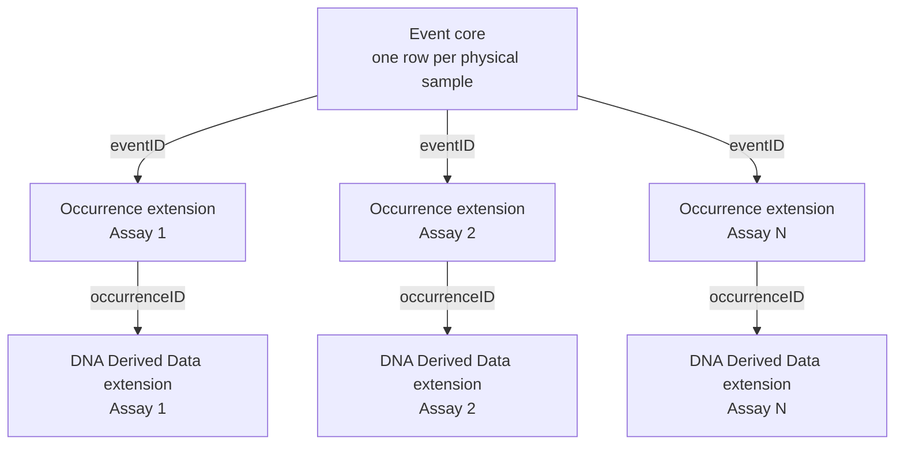

# FAIRe2OBIS

**Convert FAIRe-formatted eDNA metabarcoding data into an OBIS-ready Darwin Core Archive — including multi-assay projects, which GBIF's Metabarcoding Data Toolkit (MDT) doesn't support.**

FAIRe2OBIS is a set of R scripts that turns [FAIRe](https://fair-edna.github.io/)-formatted eDNA metabarcoding spreadsheets into a standards-compliant [Darwin Core Archive](https://dwc.tdwg.org/text/) (DwC-A), ready to publish through an [IPT](https://www.gbif.org/ipt) to [OBIS](https://obis.org/) (or GBIF). It follows the [OBIS-ENV-DATA](https://manual.obis.org/dna_data.html) Event Core pattern used for DNA-derived occurrence data.

## Why this exists

Environmental DNA (eDNA) metabarcoding projects often collect one set of physical samples (water, soil, sediment) and run them through **several different primer sets ("assays")** to capture different taxonomic groups — for example, one primer targeting fish and another targeting a broader range of marine vertebrates. The lab and field metadata (dates, coordinates, depth, environmental readings) is identical across every assay, because it's the *same physical sample*; only the sequencing and taxonomic results differ.

GBIF's [Metabarcoding Data Toolkit (MDT)](https://mdt.gbif.org/) is a great tool for converting a single-assay OTU table into a Darwin Core Archive — but it assumes **one dataset = one assay**. Running each assay through MDT separately would publish the same physical samples three times over, tripling every shared piece of sample/location/environmental metadata across independent datasets. MDT's own user guide is explicit about this: *"Mixed datasets (e.g., different primer sets used for the same set of samples) should be published separately."*

FAIRe2OBIS solves this by building the archive the other way around:

- **One Event core** — each physical sample is written as a single Event, once.
- **One Occurrence extension per assay** — the detections (ASVs) from each primer set, linked back to the Event core via `eventID`.
- **One DNA Derived Data extension per assay** — the sequence, PCR, and bioinformatics metadata for each detection, linked via `occurrenceID` (and, for archive-level linking, `eventID`).



No sample metadata is duplicated across assays, and the resulting archive correctly represents "one sampling event, multiple assays run against it" rather than N unrelated datasets.

## Who this is for

Anyone with a FAIRe-formatted multi-assay eDNA metabarcoding dataset who wants to publish it to OBIS/GBIF without triplicating their sample metadata. It's configured out of the box for a specific project's file layout, but the pipeline is written to be adapted — see [Adapting this to your own project](#adapting-this-to-your-own-project) below.

## How it works: the pipeline

The pipeline is five R scripts, run in order, plus a shared `config.R`. Each script reads the previous step's output and writes its own — nothing runs automatically end-to-end, by design, so a human reviews the output of each stage (especially taxonomy matching) before it feeds into the next.

| Script | What it does |
|---|---|
| `config.R` | Central configuration: input file paths, project ID, the assay↔projectMetadata-column mapping, output paths, and control-sample handling rules. Edit this first when adapting the pipeline to a new project. |
| `01_build_event_core.R` | Reads `sampleMetadata` from every assay's FAIRe file, cross-checks that they agree on shared sample metadata (since it should be identical across assays), splits samples into real events vs. control samples, maps FAIRe/MIxS fields to Darwin Core Event/Location terms, and writes the single Event core. Control samples are written to a separate reference file, excluded from the published archive. |
| `02_build_occurrence.R` | Reshapes each assay's OTU table (ASV × sample read-count matrix) into one row per non-zero detection, joins in taxonomy, and builds one Darwin Core Occurrence extension per assay. Handles low-confidence identifications by falling back to the lowest taxonomic rank that was actually resolved, rather than publishing a placeholder value as if it were a real name. |
| `03_build_dna_extension.R` | Builds one DNA Derived Data extension per assay — the actual ASV/OTU sequence, PCR primer and amplicon details, sequencing platform, and bioinformatics pipeline metadata — linked to script 02's output via `occurrenceID`, and to the Event core via `eventID`. |
| `04_worms_match.R` | Matches every scientific name produced by script 02 against the [World Register of Marine Species (WoRMS)](https://www.marinespecies.org/) to get a proper `scientificNameID`. Run as a deliberately separate, reviewable step — ambiguous or unmatched names are written to review files rather than guessed at, and only resolved automatically when doing so is unambiguous (e.g. picking WoRMS' own designated "accepted" record among several bookkeeping variants of the same name). |
| `05_qc_checks.R` | Runs a battery of validation checks against the finished archive before it goes anywhere near a publishing tool: required-field completeness, date formatting, coordinate sanity (on land / out of range / zero), cross-file ID consistency between the Event core and every extension, and taxonomy-match coverage. |

Run them in order from the project root:

```r
source("config.R")
source("scripts/01_build_event_core.R")
source("scripts/02_build_occurrence.R")
source("scripts/03_build_dna_extension.R")
source("scripts/04_worms_match.R")
source("scripts/05_qc_checks.R")
```

## Input format: FAIRe workbooks

Each input is a `.xlsx` workbook with (at minimum) these sheets: `projectMetadata`, `sampleMetadata`, `experimentRunMetadata`, `taxaFinal`, `otuFinal`.

`sampleMetadata`, `experimentRunMetadata`, and `taxaFinal` all have a 3-row header before the data starts (requirement level, section, then the actual column names) — the pipeline handles this automatically via `read_faire_sheet()`. `otuFinal` is a plain ASV-by-sample read-count matrix with a normal single header row.

## Output

```
output/
  event_core/Event.csv                    <- Darwin Core core
  occurrence/Occurrence_<assay>.csv        <- one Occurrence extension per assay
  dna_extension/DNADerivedData_<assay>.csv <- one DNA Derived Data extension per assay
  controls/sample_controls_reference.csv   <- excluded control samples (NOT part of the archive)
  worms_match/                             <- taxonomy-matching audit trail (NOT part of the archive)
```

Only the files in `event_core/`, `occurrence/`, and `dna_extension/` go into the published archive. `controls/` and `worms_match/` are working/audit output for your own review — negative and positive control samples are lab/field QC artifacts, not biodiversity occurrences, and don't belong in a public archive.

## Publishing

This pipeline produces the files, not the archive itself — it deliberately targets a **generic IPT** upload rather than MDT, since MDT can't accommodate a multi-assay dataset. In IPT:

1. Create a new resource and upload `Event.csv` as the core (Core Type: `Event`, ID field: `eventID`).
2. Add each `Occurrence_<assay>.csv` as a source file, set as an `Occurrence` extension, and map its `eventID` column as the core-linking ID.
3. Add each `DNADerivedData_<assay>.csv` as a source file, set as a `DNA derived data` extension, and map its `eventID` column (not `occurrenceID`) as the core-linking ID — a Darwin Core Archive has no concept of "extension of an extension," so every extension must link back to the core's own ID.
4. Map remaining fields (most auto-map, since columns are already named as exact Darwin Core terms), add dataset metadata, and publish — to a test/UAT environment first.

## Requirements

- R (developed against 4.5.x)
- Packages: `readxl`, `dplyr`, `tidyr`, `readr`, `tibble`, `worrms`, `obistools`

`worrms` is on CRAN. `obistools` is not — install it from GitHub:

```r
install.packages(c("readxl", "dplyr", "tidyr", "readr", "tibble", "worrms", "remotes"))
remotes::install_github("iobis/obistools")
```

## Adapting this to your own project

This repository ships pre-configured for one specific project's file layout. To reuse it for a different dataset, edit `config.R`:

- `INPUT_FILES` — path to each assay's FAIRe `.xlsx` file.
- `PROJECT_ID`, `EVENT_CORE_SOURCE_ASSAY` — which assay's `sampleMetadata` is treated as the source of truth (script 01 cross-checks the others against it).
- `ASSAY_PROJECT_COLUMN` — how your FAIRe files' assay names map to `projectMetadata`'s `assay1..assay4` columns. This is genuinely project-specific (which primer sets were run, and whether any were combined) — don't assume it carries over unchanged.
- `SAMPLE_CATEGORY_KEEP` — the `samp_category` value that marks a real (non-control) sample.
- `ASSOCIATED_SEQUENCES_URI` — a link/accession to where your raw sequence reads are archived (e.g. an ENA or SRA project accession). This pipeline doesn't auto-detect this; it comes from wherever your project deposited its raw reads.

Also worth checking rather than assuming: which `sampleMetadata`/`taxaFinal` columns are actually *populated* in your data before deciding what to map. Several fields with a slot in the FAIRe schema (environmental chemistry measurements, DNA extraction protocol details) may be entirely empty depending on what your project recorded — map what's real, not just what the schema allows for.

## Design principles

- **Never guess.** Ambiguous taxonomy matches, unresolved identifications, and missing metadata are surfaced for manual review, not silently filled in or defaulted.
- **Taxonomy matching is a separate, reviewable step**, not baked into the core-building scripts — so a human can check ambiguous or unmatched names before they enter a published archive.
- **Control samples never reach the published archive.**
- **Dates are never zero-padded** for unknown parts (e.g. `2011-03`, not `2011-03-00`) — a padded date asserts a day that was never actually recorded.

## Validated against real data

This isn't a hypothetical pipeline — it's been run end-to-end against the OcOm_2408 project's real FAIRe files (three assays, 628 total samples) and checked with [`obistools`](https://github.com/iobis/obistools) before being considered done.

### Samples


### Detections per assay


### Taxonomy resolved without guessing

670 unique scientific names went through WoRMS matching. Every one was resolved to a `scientificNameID` — none guessed:

| Resolution | Names | How |
|---|---:|---|
| Matched directly | 655 | A single, unambiguous WoRMS record |
| Corrected, then matched | 6 | Spelling fixes, stripped voucher/accession codes, and a wrong-kingdom homonym correction — each checked by hand against WoRMS and FishBase before applying |
| Auto-resolved | 7 | WoRMS returned multiple records, but exactly one was marked `accepted` — resolved to WoRMS' own canonical record, not a guess |
| Manually resolved | 1 | A cross-kingdom homonym with **two** `accepted` WoRMS records for genuinely different organisms (a fish genus and a red-algae genus sharing a name) — resolved by family, logged for audit |
| Fixed rank placeholder | 1 | `Biota incertae sedis` (WoRMS AphiaID 12's actual name, per OBIS's DNA-derived-data guidance), for the one case with no confident identification at any rank |
| **Total** | **670** | **100% resolved · 0 left ambiguous · 0 unmatched** |

Full audit trail, for review before publishing: `output/worms_match/matched_names.csv`, `ambiguous_resolved.csv`, `name_corrections_applied.csv`.

### QC checks (`05_qc_checks.R`)

- [x] Required Darwin Core fields present (Event + Occurrence combined)
- [x] `eventID` unique in the Event core; `parentEventID` references valid
- [x] `eventDate` format valid
- [x] No zero, missing, or out-of-range coordinates
- [x] No coordinates falling on land
- [x] Every Occurrence and DNA Derived Data row's `eventID` exists in the Event core
- [x] Every Occurrence row has a matching DNA Derived Data row, and vice versa
- [x] 100% `scientificNameID` coverage

*(Charts generated from real pipeline output by `scripts/make_readme_charts.R`, using `ggplot2` — rerun it after reprocessing a new dataset to refresh the numbers.)*

## License

*(Not yet set — decide and add a license before making this repository public.)*

## Acknowledgements

Built on top of [Darwin Core](https://dwc.tdwg.org/), the [OBIS-ENV-DATA](https://manual.obis.org/dna_data.html) extension pattern, the [`worrms`](https://docs.ropensci.org/worrms/) R client for the [WoRMS](https://www.marinespecies.org/) REST API, and [`obistools`](https://github.com/iobis/obistools) for OBIS-specific QC checks.
